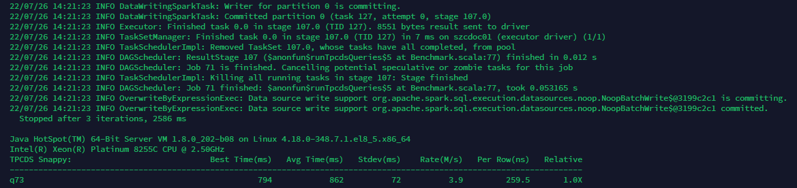
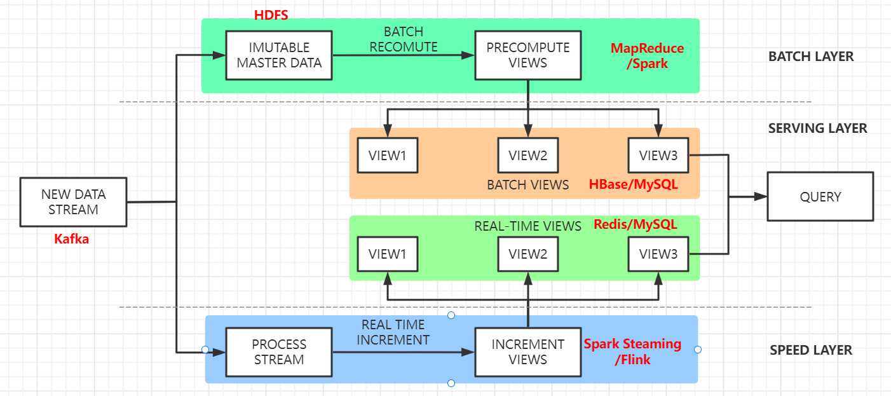

# 题目一: 分析一条 TPCDS SQL

分析一条 TPCDS SQL（请基于 Spark 3.1.1 版本解答）

* 运行该 SQL，如 q38，并截图该 SQL 的 SQL 执行图
* 该 SQL 用到了哪些优化规则（optimizer rules）
* 请各用不少于 200 字描述其中的两条优化规则
* SQL 从中任意选择一条：https://github.com/apache/spark/tree/master/sql/core/src/test/resources/tpcds

SQL选择q73，完整的SQL语句如下：

```sql
SELECT
  c_last_name,
  c_first_name,
  c_salutation,
  c_preferred_cust_flag,
  ss_ticket_number,
  cnt
FROM
  (SELECT
    ss_ticket_number,
    ss_customer_sk,
    count(*) cnt
  FROM store_sales, date_dim, store, household_demographics
  WHERE store_sales.ss_sold_date_sk = date_dim.d_date_sk
    AND store_sales.ss_store_sk = store.s_store_sk
    AND store_sales.ss_hdemo_sk = household_demographics.hd_demo_sk
    AND date_dim.d_dom BETWEEN 1 AND 2
    AND (household_demographics.hd_buy_potential = '>10000' OR
    household_demographics.hd_buy_potential = 'unknown')
    AND household_demographics.hd_vehicle_count > 0
    AND CASE WHEN household_demographics.hd_vehicle_count > 0
    THEN
      household_demographics.hd_dep_count / household_demographics.hd_vehicle_count
        ELSE NULL END > 1
    AND date_dim.d_year IN (1999, 1999 + 1, 1999 + 2)
    AND store.s_county IN ('Williamson County', 'Franklin Parish', 'Bronx County', 'Orange County')
  GROUP BY ss_ticket_number, ss_customer_sk) dj, customer
WHERE ss_customer_sk = c_customer_sk
  AND cnt BETWEEN 1 AND 5
ORDER BY cnt DESC
```

如何命令该sql的命令和文档中基本一致，为打印优化器日志，需要添加配置`--conf "spark.sql.planChangeLog.level=WARN"`，方便查看将控制台打印日志输出到日志文件q73.log中。

```bash
./spark-3.1.1-bin-hadoop2.7/bin/spark-submit --class org.apache.spark.sql.execution.benchmark.TPCDSQueryBenchmark --conf "spark.sql.planChangeLog.level=WARN" --jars spark-core_2.12-3.1.1-tests.jar,spark-catalyst_2.12-3.1.1-tests.jar spark-sql_2.12-3.1.1-tests.jar --data-location tpcds-data-1g --query-filter "q73" >q73.log 2>&1 &
```

SQL执行截图如下：



通过日志可以看到该SQL主要用到了如下优化规则：

* ColumnPruning：列裁剪
* ReorderJoin：join过滤操作下推
* PushDownPredicates：谓词操作下推
* NullPropagation：可空性（NULL 值）传播
* ConstantFolding：常量折叠
* InferFiltersFromConstraints：对join的过滤操作进行优化
* RewritePredicateSubquery：将子查询转换为left-semi/anti join操作

详细解释以下两条规则：

* ColumnPruning：列裁剪是当用到一个表时，不需要扫描它的所有列值，而是扫描只需要的列，不需要的裁剪掉。这一优化一方面大幅度减少了网络、内存数据量消耗，另一方面对于列式存储数据库来说大大提高了扫描效率。例如对于查询语句`SELECT a FROM (SELECT a,b from t)`，其中子查询中的b列实际没有被用到，因为可以直接忽略b列，优化为`SELECT a FROM (SELECT a from t)`。
* PushDownPredicates：将查询语句中的过滤表达式计算尽可能下推到距离数据源最近的地方，以尽早完成数据的过滤，进而显著地减少数据传输或计算的开销。例如对于查询`select rand(), a from (select * from t) where a > 1`就可以先将过滤条件`a > 1`先在子查询中进行过滤，优化为`select rand(), a from (select * from where a > 1)`，通过过滤先减少数据量，再进行之后的操作。

# 题目二：架构设计题

你是某互联网公司的大数据平台架构师，请设计一套基于 Lambda 架构的数据平台架构，要求尽可能多的把课程中涉及的组件添加到该架构图中。并描述 Lambda 架构的优缺点，要求不少于 300 字。

Lambda 架构包含三层，Batch Layer、Speed Layer 和 Serving Layer。架构图如下：



Lambda架构的基本概念：

* **Batch Layer**：批处理层，对离线的历史数据进行预计算，为了下游能够快速查询想要的结果。由于批处理基于完整的历史数据集，因此准确性可以得到保证。批处理层可以用 Hadoop、Spark 和 Flink 等框架计算。
* **Speed Layer**：加速处理层，处理实时的增量数据，这一层重点在于低延迟。加速层的数据不如批处理层那样完整和准确，但是可以填补批处理高延迟导致的数据空白。加速层可以用 Storm、Spark streaming 和 Flink 等框架计算。
* **Serving Layer**：合并层，计算历史数据和实时数据都有了， 合并层的工作自然就是将两者数据合并，输出到数据库或者其他介质，供下游分析。

Lambda架构的优点如下：

* **职责边界清晰**：Speed Layer处理数据为最近的增量数据流，Batch Layer处理的是全体数据集。Speed Layer为了效率，接收到新数据时不断更新Realtime View，而Batch Layer根据全体离线数据集直接得到Batch View。Speed Layer是一种增量计算，而非重新计算。
* **容错性**：Speed Layer中处理的数据也不断写入Batch Layer，当Batch Layer中重新计算的数据集包含Speed Layer处理的数据集后，当前的Realtime View就可以丢弃，这意味着Speed Layer处理中引入的错误，在Batch Layer重新计算时都可以得到修正。这点也可以看成是CAP理论中的最终一致性的体现。
* **复杂性隔离**：Batch Layer处理的是离线数据，可以很好的掌控。Speed Layer采用增量算法处理实时数据，复杂性比Batch Layer要高很多。通过分开Batch Layer和Speed Layer，把复杂性隔离到Speed Layer，可以很好的提高整个系统的鲁棒性和可靠性。

Lambda架构存在如下缺点：

* **实时与批量计算结果不一致引起的数据口径问题**：因为批量和实时计算走的是两个计算框架和计算程序，算出的结果往往不同，经常看到一个数字当天看是一个数据，第二天看昨天的数据反而发生了变化。
* **批量计算在计算窗口内无法完成**：在IOT时代，数据量级越来越大，经常发现夜间只有4、5个小时的时间窗口，已经无法完成白天20多个小时累计的数据。
* **开发和维护的复杂性问题**：Lambda 架构需要在两个不同的 API中对同样的业务逻辑进行两次编程：一次为批量计算的ETL系统，一次为流式计算的Streaming系统。针对同一个业务问题产生了两个代码库，各有不同的漏洞，这种系统实际上非常难维护。
* **服务器存储大**：数据仓库的典型设计，会产生大量的中间结果表，造成数据急速膨胀，加大服务器存储压力。